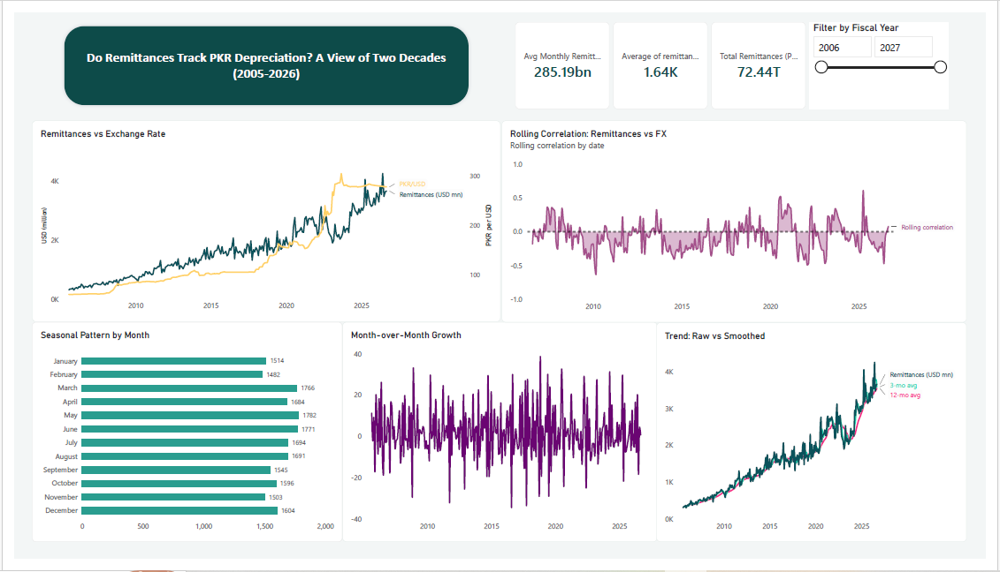

# Do Remittances Track PKR Depreciation? A 21-Year Analysis (2005-2026)

## Overview
This project examines whether Pakistan's worker remittances move in step with the depreciation of the Pakistani Rupee against the US Dollar over roughly 21 years of monthly data. It combines Python for analysis and feature engineering, and an interactive Power BI dashboard.

## Research Question
Does PKR depreciation correlate with (or drive) changes in remittance inflows, and does this relationship show any seasonal or long-term pattern?

## Data Sources
- Workers' Remittances (Million USD) — State Bank of Pakistan [www.easydata.sbp.org.pk](https://easydata.sbp.org.pk)
- PKR/USD Exchange Rate (Month-End) — State Bank of Pakistan [www.easydata.sbp.org.pk](https://easydata.sbp.org.pk)

## Method

1. **Analysis & feature engineering (Python/pandas)** — normalized both series to a common monthly date grain (source files used different day-of-month conventions), corrected exchange rate orientation, and derived month-over-month % change, year-over-year % change, 3-month and 12-month rolling averages, remittances in PKR terms, and 12-month rolling correlation.
2. **Dashboard (Power BI)** — interactive visualization built from the enriched dataset, with a fiscal-year filter.

## Key Findings
1. Both series trend upward over the full period — this looks like a strong relationship in raw levels, but that's largely a shared-growth illusion, not real co-movement.
2. The actual relationship (rolling correlation on % change) is weak and inconsistent — hovering near zero, with no sustained strong positive stretch. This is the project's central finding.
3. Remittances show moderate seasonality, peaking in March, May, and June and dipping in February, September, and November — a roughly 20% spread between the highest and lowest months. Given the ~21-year span, this likely reflects a mix of factors rather than a single fixed calendar event, since Ramadan/Eid's date shifts across nearly every Gregorian month over that period.
4. Correlation computed on raw levels initially looked misleadingly strong; switching to % change gave a more honest, weaker result — worth noting as a methodological lesson.

## Limitations
- Uses the unadjusted (NSA) remittances series specifically to preserve seasonality.
- Early rows have fewer data points feeding into rolling calculations.
- Correlation doesn't imply causation.

## Repo Contents
- `analysis.py` — Python cleaning/feature engineering/chart pipeline
- `pakistan_remittance_dashboard.pbix` — Power BI dashboard file
- `dashboard_export.pdf` — static export of the dashboard for viewing without Power BI
- `cleaned_merged.csv` — final enriched dataset

## Tools Used
Python (pandas), Power BI Desktop

## Dashboard Image

